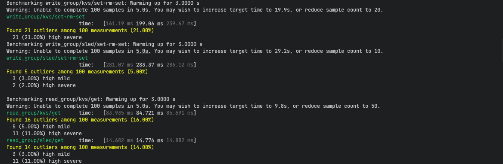
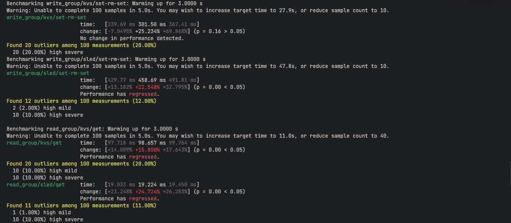
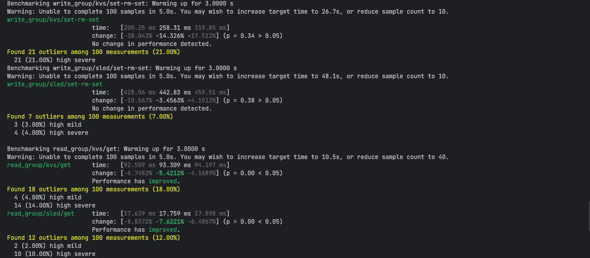
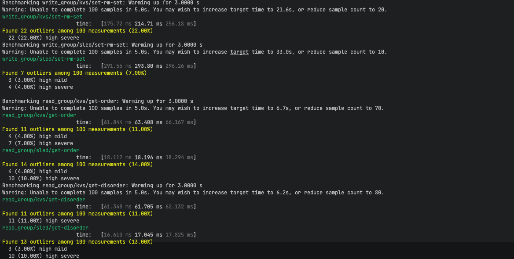
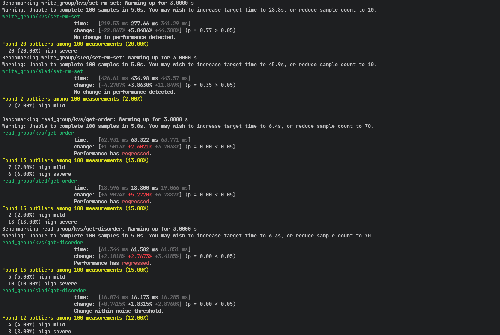

# kvs (`thedevplus`)

A log-structured key-value store implemented in Rust.

[](https://www.rust-lang.org)
[](LICENSE)

> Designed and implemented based on the industrial-grade technical specifications and test suites of the [PingCAP Talent Plan](https://github.com/pingcap/talent-plan) (Practical Networked Applications in Rust).

---

## Overview

This project implements a log-structured key-value store inspired by the Bitcask design pattern. It demonstrates core systems programming concepts in Rust.

## Features

- **Append-only Log**: Sequential writes for optimal I/O performance
- **In-memory Index**: O(1) read complexity via HashMap
- **Automatic Compaction**: Background garbage collection
- **CLI Interface**: Interactive command-line tool

## Project Roadmap & Progression

- [x] **Milestone 1**: In-memory prototype with `clap` CLI parser.
- [x] **Milestone 2**: Log-structured engine (Bitcask pattern) with compaction. *(Fully implemented in one sprint; 100% tests passed)*
- [x] **Milestone 3**: Custom TCP networking stack with line-based framing. *(Completed and Verified with 5 rounds of Criterion benchmarks)*

  
  
  

- [ ] **Milestone 4**: Thread-pool concurrency engine (`Send + Sync` optimization). — *In Progress*
- [ ] **Milestone 5**: Full asynchronous migration via Tokio runtime.

## Optimization Results

Performance comparison after optimizing read performance by caching BufReader per log file:

### Optimization

- **BufReader caching**: Maintain a dedicated BufReader for each log file to avoid repeated file handle creation.

### Key Findings

- **Read**: After optimization, ordered and disordered reads have similar performance, with read time improved by ~30%.




## Usage

### Server

Start the key-value store server:

```bash
# Start with default settings (kvs engine, 127.0.0.1:4000)
kvs-server

# Start with KvStore engine
kvs-server --engine kvs

# Start on a custom address
kvs-server --addr 192.168.1.100:4000

# Start with KvStore engine on custom address
kvs-server --engine kvs --addr 0.0.0.0:4000
```

**Server Options:**
- `--addr <SOCKET_ADDR>`: Socket address to listen on (default: `127.0.0.1:4000`)
- `--engine <ENGINE>`: Storage engine to use (`kvs` or `sled`, default: `kvs`)

**Storage Engines:**
- `kvs`: Custom log-structured key-value store (Bitcask pattern)
- `sled`: Embedded database using the sled library

### Client

Connect to the server and perform operations:

```bash
# Set a key-value pair
kvs-client set key value

# Set with custom server address
kvs-client set key value --addr 127.0.0.1:4000

# Get a value by key
kvs-client get key

# Remove a key
kvs-client rm key
```

**Client Options:**
- `<COMMAND>`: Operation to perform (`set`, `get`, or `rm`)
- `<KEY>`: Key to operate on
- `[VALUE]`: Value to set (required for `set` command)
- `--addr <SOCKET_ADDR>`: Server address to connect to (default: `127.0.0.1:4000`)

### Library API

Use as a Rust library:

```rust
use kvs::{KvStore, SledKvsEngine, KvsEngine, Result};

// Open a KvStore in current directory
let mut store = KvStore::open("./")?;
store.set("key".to_string(), "value".to_string())?;
let value = store.get("key".to_string())?; // Returns Option<String>
store.remove("key".to_string())?;

// Or use SledKvsEngine in current directory
let mut sled = SledKvsEngine::open("./")?;
sled.set("key".to_string(), "value".to_string())?;
let value = sled.get("key".to_string())?;
sled.remove("key".to_string())?;
```

### Configuration Constants

The following constants are defined in the source code and can be modified for customization:

**Log File Settings (`src/kvs.rs`):**
- `LOG_FILE_EXT`: File extension for log files (default: `"log"`)
- `LOG_FILE_SIZE`: Maximum size per log file before rotating (default: `1 MB` = 1024 * 1024 bytes)
- `LOG_UNCOMPACT`: Threshold of stale entries before triggering compaction (default: `1000`)

**Server Settings (`src/bin/kvs-server.rs`):**
- `LOG_FILE_DIR`: Directory name for storing log files (default: `"database"`)

**Example Customization:**

To change the maximum log file size to 10MB:
```rust
const LOG_FILE_SIZE: u64 = 10 * 1024 * 1024; // 10 MB
```

## Ongoing Optimizations

- **Write Performance Analysis**: The write time of Sled engine is roughly 1.5 times that of KvStore engine, but KvStore engine exhibits less stability, with significant performance fluctuations exceeding 20%. This is likely related to forced compaction during writes, leaving substantial room for optimization.

- **Read Performance Optimization**: The read time of KvStore engine is approximately 5-6 times that of Sled engine. While stability is comparable, there is still room for improvement. The slow read speed is likely because key/value pairs are not cached in memory—each read requires file I/O. Currently, only index pointers are kept in memory, representing a potential optimization direction.

## License

MIT